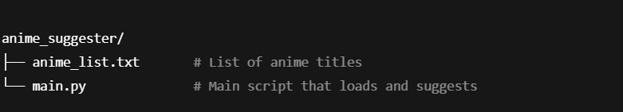

# Anime-Suggester
A Program to challenge my own skills and build a useful tool.
=======
# 📄 Project Overview Document  
<!-- 📄 Emoji to visually represent a document -->

## 🏷️ Title  
### Random Anime Suggestion Program  
<!-- 🏷️ Emoji for “label” or “title”. Headings use #, ##, ### where more # means smaller heading -->

## 🔢 Code  
### WWAL1

## 🎯 Purpose  
To create a simple program that can suggest anime titles randomly to the user.

## ✅ Goals  
- To enhance my skills as a programmer.  
- To work on real, practical projects instead of only theory.  
- To create a program that is useful for myself and potentially for others.  
- To build a basic structure that can be improved and expanded with more features over time.

---

<!-- --- creates a horizontal rule to separate sections -->

## 🧰 Functionality

| Feature             | Description                                          |  
|---------------------|------------------------------------------------------|  
| **Random Suggestion**| Selects one anime at random from a list and displays it. |  
| **External File Use**| Uses a `.txt` file to store anime names; one anime per line. |  
| **No User Input Needed** | The program runs and immediately prints a suggestion. |

> Note: We can work on inputs when more features are added.  
<!-- > creates a blockquote (indented note) -->

---

## 🏗️ Structure of Program  

## ⚙️ How It Works (Logic Flow)  

1. Load the list of anime titles from `anime_list.txt`.  
2. Use Python's `random.choice()` to pick one title.  
3. Display the result in the terminal as:  

## 📄 Documentation Files

- [Download Project Overview (DOCX)](Documentation/Project-Overview.docx)
- [Download Project Overview (PDF)](Documentation/Project-Overview.pdf)

